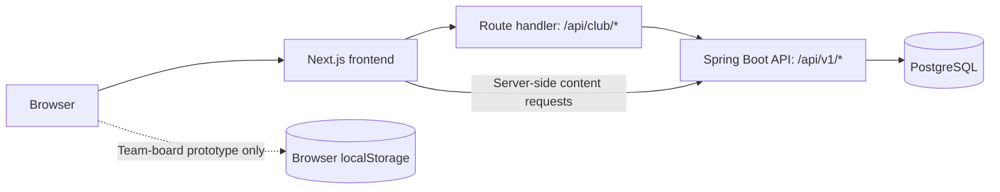

<div align="center">
  
  <h1>Yazılım Atölyesi · Frontend</h1>
  <p>The club website, administration dashboard, and team task-board prototype.</p>
  <p>
    <a href="#getting-started">Getting started</a> ·
    <a href="#features-and-current-status">Features</a> ·
    <a href="#testing">Testing</a> ·
    <a href="#contributing-and-team-workflow">Contributing</a> ·
    <a href="#documentation">Documentation</a>
  </p>
</div>

Yazılım Atölyesi is a software club at İstanbul Gedik University. This repository contains its Next.js frontend: a public website for announcements, membership applications, and contact, plus a role-aware dashboard for club administrators and editors. The application interface is in Turkish.

The frontend connects to a separate Spring Boot API. Public content and administration operations use that API; the team task board is currently a **browser-local prototype**.

| Repository | Responsibility |
| --- | --- |
| [Frontend](https://github.com/yazilimatolyesi1/Yazilim-atolyesi-front-end) | Website, dashboard, Next.js API proxy, frontend tests, and documentation |
| [Backend](https://github.com/yazilimatolyesi1/yazilim_atolyesi_websitesi) | Authentication, authorization, application data, media storage, and database |

## Features and current status

### Public website

- Club introduction, about section, team information, and contact details.
- Announcements loaded from the API, with search, pagination, and a detail dialog.
- Membership registration using backend-provided options and consent document versions.
- Sign-in and membership status display.
- Contact form connected to the backend.
- Responsive layouts, loading states, empty results, and connection-error messages.

### Administration dashboard

Available at `/yonetim` after signing in with an authorized account.

| Area | Capabilities | Access |
| --- | --- | --- |
| Overview | Application, message, announcement, and user/content summaries | `ADMIN`, `EDITOR`; role-dependent content |
| Membership applications | Filter, inspect details, approve/reject, and record review notes | `ADMIN` |
| Announcements | Create, edit, delete, manage publication status, upload images, pin, and order | `ADMIN`, `EDITOR` |
| Contact messages | Read, filter, update tracking status, and delete | `ADMIN`, `EDITOR` |
| Page content | Manage text, images, links, visibility, and ordering | `ADMIN`, `EDITOR` |
| Site settings | Manage contact, social, consent-related, and other settings | `ADMIN`, `EDITOR` |
| Users | Manage account roles and status | `ADMIN` |
| Account security | Change the current account password | `ADMIN`, `EDITOR` |
| Team tasks | Try separate frontend/backend task boards locally | `ADMIN`; prototype only |

Backend authorization remains authoritative for API operations. A `MEMBER` account does not gain dashboard access simply by registering.

### Team task board

Open `/yonetim#ekip-gorevleri`, or choose **Ekip görevleri** in the dashboard.

The prototype supports:

- Separate **Frontend** and **Backend** boards and member lists.
- Task titles, descriptions/completion criteria, assignees, optional due dates, and work notes.
- **Backlog → Yapılacak → Devam ediyor → Tamamlandı** status tracking.
- Search, assignee filtering, and completion counts.
- A member-view preview that shows one team and allows changes to that member's assigned task status and notes.
- Browser-local persistence and JSON export through **Kayıtları indir**.

> **Current limitation:** Team members are local names, not application accounts. The member view does not create a backend role or enforce real team authorization. Records are stored in the current browser under `club-team-board:v1:<userId>` and are not synchronized across accounts or devices. Clearing browser data removes them. JSON import is not implemented.
>
> Shared team use requires backend persistence, team membership, authorization, and API integration. Those features are not part of this prototype.

### Content behavior to know

- Page blocks and supported public contact/social settings are connected to the backend.
- Team descriptions, working steps, and club rules still include static frontend content.
- A `SLIDER` block currently renders as a content card, not an automatic carousel.
- Marking a message as **Yanıtlandı** updates its tracking status; it does not send an email.
- Saving a new setting key does not automatically create a corresponding interface element.
- Image upload is supported; a complete media-library listing is not implemented.

## Technology

Versions below reflect the checked-in dependency lockfile at the time of this documentation update. Use `npm ci` to install the locked dependencies.

| Technology | Version | Purpose |
| --- | --- | --- |
| Next.js | 16.3.4 | App Router, server rendering, routing, API proxy |
| React / React DOM | 18.3.1 | Interface components and state |
| TypeScript | 5.6.2 | Static typing |
| Tailwind CSS | 3.4.13 | Styling alongside global CSS and CSS Modules |
| Playwright | 1.63.0 | Browser and integration tests |

## Getting started

### Prerequisites

- **Node.js 20.9 or later**, compatible with the installed Next.js package; the existing deployment guide uses Node.js 22.x.
- npm and Git.
- A reachable backend for authentication, announcements, registration, contact, and administration.
- An existing backend `ADMIN` or `EDITOR` account to access the dashboard. The team-board prototype requires `ADMIN`.

Docker is not required to start the frontend itself. It is required by the existing Docker-based backend setup and some integration tests.

### 1. Clone and install

```sh
git clone https://github.com/yazilimatolyesi1/Yazilim-atolyesi-front-end.git
cd Yazilim-atolyesi-front-end
npm ci
```

### 2. Configure the environment

Copy `.env.example` to `.env.local` once. Preserve any existing local configuration.

**PowerShell:**

```powershell
Copy-Item .env.example .env.local
```

**macOS / Linux:**

```sh
cp .env.example .env.local
```

For the default local setup:

```dotenv
CLUB_API_URL=http://127.0.0.1:8080/api/v1
CLUB_SITE_URL=http://localhost:3001
```

| Variable | Meaning |
| --- | --- |
| `CLUB_API_URL` | Backend API base URL reachable from the **Next.js server**, including `/api/v1` |
| `CLUB_SITE_URL` | Exact frontend origin used in the browser, including protocol and port; used for mutation-origin checks and session-cookie configuration |

Neither variable needs a `NEXT_PUBLIC_` prefix. Restart the frontend after changing environment configuration.

`localhost` and `127.0.0.1` are different origins. Use the configured browser address consistently. In a container or remote host, `127.0.0.1` refers to that environment, not your development computer.

### 3. Start the backend

Follow the [backend repository's setup instructions](https://github.com/yazilimatolyesi1/yazilim_atolyesi_websitesi). For the default local backend, its health endpoint is:

```text
http://127.0.0.1:8080/actuator/health
```

The earlier combined workspace used a parent-level `compose.local.yaml`. **That file is not included in this frontend repository.** Cloning this repository alone does not provision the backend or database.

### 4. Start the frontend

```sh
npm run dev:local
```

Open **http://localhost:3001**.

For a local production build instead:

```sh
npm run build
npm run start:local
```

Run either the development server or the production server on port 3001, not both simultaneously. Stop the active server with `Ctrl+C` before switching.

## Routes

| Path | Purpose |
| --- | --- |
| `/` | Public club website |
| `/duyurular` | Announcement list and detail dialog |
| `/uye-kaydi` | Membership registration |
| `/giris-yap` | Sign-in and member account/status view |
| `/yonetim` | Administration dashboard |
| `/yonetim#ekip-gorevleri` | Team-board prototype within the dashboard |
| `/hero-tasarimlari` | Hero design exploration page |
| `/api/club/*` | Allowlisted frontend API proxy routes |

About, team, and contact content is also presented as sections of the public site; these are not separate page routes.

## Architecture and API integration



- `lib/api.ts` sends browser requests through the same-origin `/api/club` proxy and normalizes API errors.
- `lib/server-api.ts` retrieves public data for server-rendered content.
- `app/api/club/[...path]/route.ts` forwards explicitly permitted method/path combinations to the backend.
- Sign-in stores the JWT in the `club_session` **HttpOnly** cookie. The token is not returned to browser application code or stored in localStorage.
- Protected proxy requests attach the bearer token server-side. Mutation requests validate the request origin.
- The proxy handles JSON, multipart image uploads, binary images, and empty `204` responses.
- `/yonetim` checks the profile and roles on the server before displaying the dashboard.
- Frontend logout clears the session cookie; it does not revoke an already issued backend JWT.

Example browser request:

```ts
import { request } from "./lib/api";

const page = await request("announcements?page=0&size=9");
```

This reaches `/api/club/announcements`, which forwards to `${CLUB_API_URL}/announcements`. The proxy is an allowlist, not a general-purpose gateway: a backend endpoint may exist without being exposed through it.

## Repository structure

```text
app/                        App Router pages, layouts, error/loading views
  api/club/[...path]/       API proxy and session-cookie handling
  yonetim/                  Server-side dashboard access check
components/                 Public website and form components
  admin/                    Dashboard, management forms, team-board UI
lib/                        API helpers, data types, mappings, board model
docs/                       Integration notes, guides, and team plans
  kisi-gorevleri/            Four individual PDF task cards
public/                     Logo, images, and design explorations
tests/e2e/                  Playwright browser/integration tests
playwright.config.ts        Test configuration and report paths
server.js                   Custom Node.js entry point for hosts such as Plesk
.env.example                Local environment template
```

## Available commands

| Command | Behavior |
| --- | --- |
| `npm ci` | Install dependencies from the lockfile |
| `npm run dev:local` | Development server at `localhost:3001` |
| `npm run dev` | Default Next.js development server, normally port 3000 |
| `npm run typecheck` | TypeScript validation without emitting application files |
| `npm run build` | Production build |
| `npm run start:local` | Serve the production build at `localhost:3001` |
| `npm start` | Default production server, normally port 3000 |
| `npm run test:e2e` | Run all Playwright E2E files; read the prerequisites below first |
| `node server.js` | Custom production entry point; uses `PORT` or defaults to 3000 |

If using port 3000, update `CLUB_SITE_URL` accordingly before starting.

**Lint status:** `package.json` currently defines `npm run lint` as `next lint`. That command is not supported by the installed Next.js version. An ESLint configuration and replacement script are still needed; lint is not a working validation check in this repository yet.

## Testing

### Static and production checks

```sh
npm run typecheck
npm run build
```

These do not replace browser testing of authenticated workflows.

### Browser installation

```sh
npx playwright install chromium
```

The test configuration does not start the application automatically. Start the frontend and its required backend in separate terminals first.

### Team-board tests

```sh
npx playwright test tests/e2e/team-board.spec.ts
```

These tests use the existing backend administrator login to open the dashboard, but task/member data stays in isolated test-browser storage. They cover team separation, assignment, member preview, reload persistence, deletion, form protection, storage errors, export, and desktop/mobile layouts. They do not create backend team records or stop the backend.

### Full integration suite

```sh
npm run test:e2e
```

Run the full suite only in a disposable local test environment with the expected backend, database, and parent-level `compose.local.yaml` layout available:

- `admin.spec.ts` creates and changes backend records, temporarily updates a site setting, and uses Docker/PostgreSQL for cleanup.
- `integration.spec.ts` creates backend test data, checks database state, and temporarily stops/restarts the backend for its outage scenario.
- Those two suites enforce localhost URLs and assume the original combined workspace layout.
- A standalone clone without that external setup is **not sufficient** to run the complete suite successfully.

| Optional test variable | Default / purpose |
| --- | --- |
| `UI_TEST_URL` | `http://localhost:3001`; frontend test target |
| `E2E_API_URL` | `http://127.0.0.1:8080/api/v1`; direct API target for the admin/integration suites |
| `E2E_ADMIN_EMAIL` | Administrator email; defaults to the backend's local development seed account |
| `E2E_ADMIN_PASSWORD` | Administrator password; override when local credentials differ |

Set overrides in the test process environment; Playwright configuration does not load `.env.local` for these variables. Keep credentials out of committed files. Changing `E2E_API_URL` does not change the frontend server's `CLUB_API_URL`.

Reports are written to `.e2e-results/results.json`, with failure artifacts under `.e2e-results/artifacts/`. These paths are ignored by Git.

**Recorded local validation — 26 September 2026:** Production build and TypeScript checks passed. The existing dashboard/integration suites passed 11 scenarios during the earlier integration work; the subsequently added team-board suite passed all 6 scenarios separately. These are local validation records, not a CI status or a guarantee for every environment.

## Deployment

This application requires a **Node.js server**. The API proxy and authenticated dashboard mean that uploading `.next` as a static website is not sufficient.

1. Provision a reachable backend and configure `CLUB_API_URL`.
2. Set `CLUB_SITE_URL` to the actual HTTPS frontend origin.
3. Install dependencies, including build tooling: `npm ci --include=dev`.
4. Build with `npm run build`.
5. Start using `npm start`, or the host-managed `server.js` entry point.
6. Verify public pages, API connectivity, login, and form submission through the deployed origin.

Keep `.env.local`, tokens, and real credentials out of Git. GitHub hosting of this repository does not itself deploy the application. Reverse-proxy handling and backend rate-limit behavior need environment-specific verification.

See [Plesk deployment notes](docs/PLESK-YAYINLAMA.md) for the existing hosting workflow. Configure both environment variables above when using that guide. Its historical fallback-content note is outdated: current announcement loading distinguishes API failure from an empty list rather than supplying sample announcements.

## Contributing and team workflow

Use short-lived branches and pull requests against `main`.

```sh
git switch main
git pull --ff-only
git switch -c feat/announcement-filters
```

For each task:

1. Define one owner, a small scope, and observable acceptance criteria.
2. Identify the existing endpoint and response shape before changing a screen.
3. Implement the task using existing components and API helpers where practical.
4. Check loading, empty, error, and mobile behavior for the affected screen.
5. Run relevant checks and describe their results in the pull request.
6. Ask another team member to review before merging.

A useful task card includes **title, goal, owner, endpoint, acceptance criteria, and status**. Select manageable tasks from the backlog at the start of the week, update progress daily, and demonstrate completed work at the end. The [weekly plan](docs/ONE-WEEK-TEAM-PLAN.md) and [PDF task cards](docs/kisi-gorevleri/) provide starting assignments; they describe planned work, not features already completed.

The current team board can be used to try this workflow locally. Until shared persistence exists, use GitHub Issues/Projects for team-wide tracking rather than expecting different browsers to share the prototype's records.

## Troubleshooting

| Symptom | Check |
| --- | --- |
| API requests return `503` | Backend health and whether the Next.js server can reach `CLUB_API_URL` |
| Forms return an origin-related `403` | Exact `CLUB_SITE_URL`, browser protocol/host/port, and reverse-proxy configuration |
| Dashboard access is denied | The backend account must have `ADMIN` or `EDITOR`; team tasks require `ADMIN` |
| Port 3001 is already in use | Stop the other frontend process or choose a different port and update the site origin |
| Production changes do not appear | Rebuild and restart the production process |
| Team tasks are missing on another computer | Expected for localStorage; the prototype does not synchronize devices |
| Local board cannot be read | Check browser storage access; invalid records are not silently overwritten |
| Full tests fail on Docker/Compose commands | Restore the documented external test workspace; the Compose file is not in this repository |
| `npm run lint` fails | The legacy `next lint` script needs replacement; see command notes above |

## Documentation

Most detailed project documents are in Turkish.

| Document | Contents |
| --- | --- |
| [Administration dashboard](docs/ADMIN-DASHBOARD.md) | Management screens, roles, and connected content |
| [Team task board](docs/TEAM-BOARD.md) | Prototype usage, local persistence, and limits |
| [Local integration](docs/LOCAL-INTEGRATION.md) | Original combined workspace, backend setup, and E2E behavior |
| [One-week team plan](docs/ONE-WEEK-TEAM-PLAN.md) | Frontend work distribution and existing API references |
| [Individual task cards](docs/kisi-gorevleri/) | Four branded, single-page PDFs |
| [Backend integration plan](docs/BACKEND-INTEGRATION-PLAN.md) | Integration planning context |
| [Plesk deployment](docs/PLESK-YAYINLAMA.md) | Hosting and custom server setup |
| [UI review](docs/UI-REVIEW.md) | Design review notes |

## License

No license file is currently included in this repository. Contact the repository maintainers before redistributing or reusing the project beyond permissions already granted to you.
